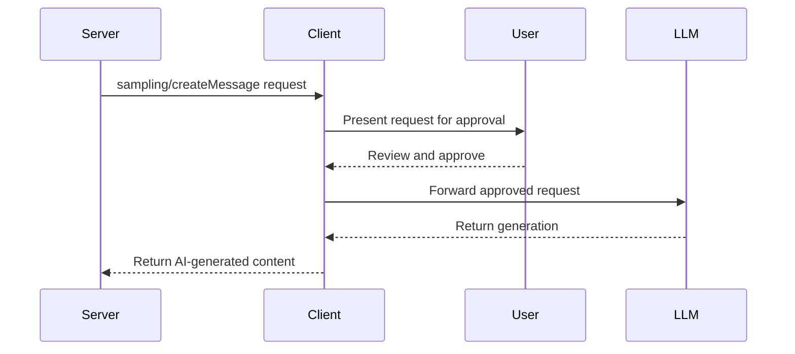

# MCP Sampling Tutorial

## Introduction to MCP Sampling

MCP Sampling is a powerful feature that allows servers to request AI-generated content from compatible clients. This tutorial demonstrates how sampling works in the Model Context Protocol through a practical implementation in the Virtual Library Server.

## What is Sampling?

In the MCP architecture:
- **Resources** provide read-only data
- **Tools** perform actions with side effects  
- **Prompts** define templates for LLM interactions
- **Sampling** enables servers to request LLM completions from clients

Sampling inverts the typical flow - instead of clients asking servers for data, servers can ask clients to generate content using their LLM capabilities.

## How Sampling Works



## Key Components

### 1. Client Capability Check

Not all MCP clients support sampling. Always check first:

```python
if not context.session.client_capabilities.sampling:
    # Fallback to non-AI functionality
    return None
```

### 2. Request Structure

A sampling request includes:

```python
from mcp.types import (
    CreateMessageRequestParams,
    SamplingMessage,
    TextContent,
    Role,
    ModelPreferences,
    ModelHint
)

# Build the request
request = CreateMessageRequestParams(
    messages=[
        SamplingMessage(
            role=Role.USER,
            content=TextContent(
                type="text",
                text="Your prompt here"
            )
        )
    ],
    model_preferences=ModelPreferences(
        hints=[ModelHint(name="claude-3-sonnet")],
        intelligence_priority=0.8,
        speed_priority=0.5,
        cost_priority=0.3
    ),
    system_prompt="You are a helpful assistant",
    max_tokens=500,
    temperature=0.7
)
```

### 3. Model Preferences

Model preferences guide the client's model selection:

- **intelligence_priority** (0-1): How important are advanced capabilities?
- **speed_priority** (0-1): How important is fast response time?
- **cost_priority** (0-1): How important is minimizing cost?

Higher values indicate higher priority for that aspect.

### 4. Making the Request

```python
result = await context.session.create_message(request)

if result and result.content.type == "text":
    generated_text = result.content.text
```

## Virtual Library Implementation

Our implementation demonstrates sampling through the `book_insights` tool, which generates:
- Book summaries
- Theme analysis
- Discussion questions
- Similar book recommendations

### Example: Generating a Book Summary

```python
async def generate_book_summary(context, book):
    prompt = f"""Create an engaging summary for this library book:

    Title: {book.title}
    Author: {book.author_name}
    Genre: {book.genre}
    Published: {book.publication_year}
    
    Generate a compelling 2-3 paragraph summary..."""

    return await request_ai_generation(
        context=context,
        prompt=prompt,
        system_prompt="You are a knowledgeable librarian...",
        max_tokens=400,
        intelligence_priority=0.8,  # High quality important
        speed_priority=0.4,         # Speed less critical
    )
```

## Usage Example

To use the book insights tool:

```bash
# Request a summary
mcp call generate_book_insights --isbn "978-0-13-110362-7" --insight_type "summary"

# Request theme analysis
mcp call generate_book_insights --isbn "978-0-13-110362-7" --insight_type "themes"

# Request discussion questions
mcp call generate_book_insights --isbn "978-0-13-110362-7" --insight_type "discussion_questions"
```

## Error Handling

Always implement graceful fallbacks:

```python
try:
    result = await context.session.create_message(request)
    if result:
        return result.content.text
except Exception as e:
    logger.error(f"Sampling failed: {e}")
    return generate_fallback_content()
```

Common error scenarios:
- Client doesn't support sampling
- User rejects the sampling request
- Timeout or network issues
- LLM API errors

## Testing Sampling

Testing sampling requires mocking since we can't rely on actual LLM responses:

```python
# Mock a successful response
mock_response = CreateMessageResult(
    role=Role.ASSISTANT,
    content=TextContent(
        type="text",
        text="Generated content here"
    ),
    model="claude-3-sonnet",
    stop_reason="end_turn"
)

mock_context.session.create_message = AsyncMock(return_value=mock_response)
```

## Best Practices

1. **Always Check Capabilities**: Not all clients support sampling
2. **Provide Fallbacks**: Ensure functionality works without AI
3. **Set Appropriate Priorities**: Balance quality, speed, and cost
4. **Use Clear Prompts**: Be specific about what you want
5. **Handle Errors Gracefully**: Users may reject requests
6. **Cache Results**: Avoid redundant API calls
7. **Test Thoroughly**: Mock different scenarios

## Security Considerations

- **User Consent**: Clients should always ask users before sending data to LLMs
- **Data Privacy**: Be mindful of what information you include in prompts
- **Rate Limiting**: Implement limits to prevent abuse
- **Content Filtering**: Consider what types of content are appropriate

## Try It Yourself

1. Run the Virtual Library server with a sampling-compatible client
2. Use the `generate_book_insights` tool on different books
3. Compare AI-generated content with fallback responses
4. Experiment with different model preferences
5. Try implementing your own sampling use case

## Advanced Topics

### Caching Strategies

```python
# Simple in-memory cache
cache = {}
cache_key = f"{isbn}:{insight_type}"

if cache_key in cache:
    return cache[cache_key]

result = await generate_with_sampling()
cache[cache_key] = result
return result
```

### Different Content Types

Sampling supports multiple content types:
- Text (most common)
- Images (base64 encoded)
- Audio (base64 encoded)

### Context Management

Include relevant context in your prompts:
```python
# Include MCP server context
include_context="thisServer"  # or "allServers" or "none"
```

## Conclusion

MCP Sampling opens up powerful possibilities for creating dynamic, AI-enhanced experiences in your MCP servers. By following the patterns demonstrated in this Virtual Library implementation, you can add intelligent features while maintaining compatibility with clients that don't support sampling.

Remember: sampling is an optional enhancement. Always design your tools to provide value even without AI capabilities, then use sampling to make them even better.